title: 开始mbed设计
---
# 开始mbed设计
应用mbed开始设计，最简单方式莫过于选择一套硬件，学习mbed HDK API函数。开始设计分为以下几个部分
- 选择一套硬件平台
- 选择软件开发环境
- 学习mbed API函数
- 加入社区学习
## mbed硬件介绍
mbed硬件主要由mbed官方联系各半导体厂家推出，国内美信凌科与我们团队推出相关的产品。

### mbed硬件官方平台介绍
mbed硬件是有更大半导体厂家与ARM公司联合推出，选择硬件有几个点，第一国内相关处理器的用量，因为用量会决定处理器的价格，第二相关处理器的资料开发资料是否全部，因为对于我们来说，我们只是开发者。
mbed硬件现在官方支持的平台约有26款，意法半导体Nucleo 系统的5款产品，后续会推出3款，全面覆盖STM32系统产品。

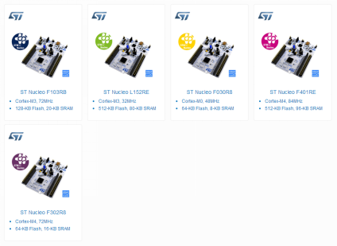

> 意法半导体微控制器产品部总经理Michel Buffa表示：“STM32 Nucleo将易用性、灵活性、连接功能和主流工具资源兼容性完美地融合在一起，是当今的嵌入式开发人员的理想的开发平台。STM32 Nucleo还为开发人员在各种不同项目中重新定位设计、再用硬件和软件IP带来更多灵活性，充分发挥STM32系列出色的外设多元化和系统扩展性优势。”
ARM物联网平台总监Simon Ford补充说：“这款具有 mbed功能的STM32 Nucleo硬件让意法半导体的客户有机会利用庞大的mbed开发软件、工具和社区生态系统，并支持新一代智能电子产品开发。”
四款STM32 Nucleo 开发板支持STM32 F1、L1、F4和F0超值型系列，意法半导体预计将在2014年第二季度推出支持STM32 F3、L0和F0三个系列的后续产品。
STM32 Nucleo-F030R8、STM32 Nucleo-F103RB、STM32 Nucleo-F401RE和STM32 Nucleo-L152RE即日上市。STM32 Nucleo-F072RB、STM32 Nucleo-F302R8、STM32 Nucleo-F334R8和STM32 Nucleo-L053R8开发板将于2014年第二季度上市。

飞思卡尔推出的FRDM系统的mbed硬件，现有产品四个型号M0+内核三个产品，M4内核一个产品，对于飞思卡尔并没有看到太多的关于mbed产品系列的相关信息。
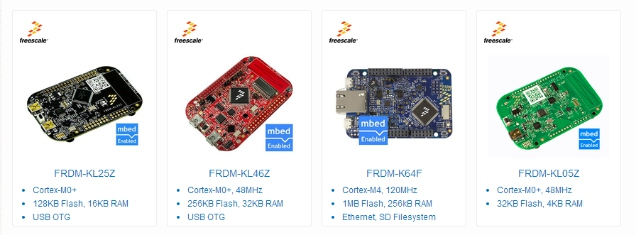

恩智浦半导体相关mbed产品总共有16个产品，由8个公司推出，近期在跟踪mbed产品时，最近NXP的mbed硬件又加入了一个成员。

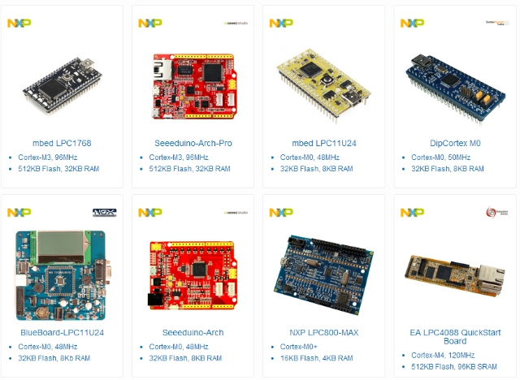

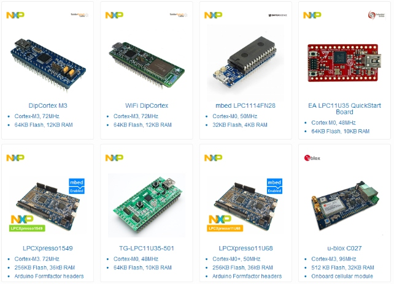
	Nordic公司推广一个mbed硬件，也是唯一一个有蓝牙功能的mbed硬件平台，对于这个公司不太熟悉，相关产品也没有用过。

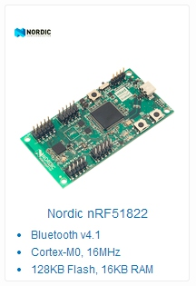

### mbed国内硬件平台介绍
国内有美信凌科推出一套mbed硬件平台，美信凌科公司在国内无线传感网络做的相当不错，另一家就是我们团队在做mbed硬件，目前团队在设计的硬件平台有基于意法半导体与恩智浦两家公司四个型号的产品。
xbed LPC1768是本网站在mbed LPC1768的基础之上，结合国内物联网开发和应用的需求而专么定制的高性能物联网开发节点，也是当前市场上性价比最高的mbed开发板。它在mbed lpc1768的基础上集成了RJ45以太网接口，TF卡接口，RF231射频芯片、SWD调试接口和用户自定义按钮，并集成了DS2411唯一ROM芯片用作以太网或无线的mac地址，并直接采用CP2104 USB转串口芯片来完成串口调试和基于FLASHMAGIC的程序上载。另外，xbed LPC1768还附带了基于Eclipse的离线开发平台，非常适合国人使用，整个开发板布局实物图及管脚引出图如下，左边的按钮为RESET，右边的按钮和p2.8管脚相连：

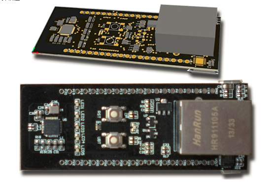

xbed LPC1768硬件平台
至博通信团队推出的zhi board 系列，

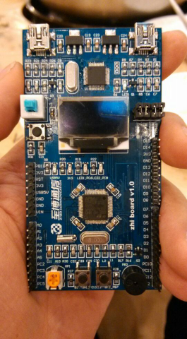
zhi board stm32 硬件平台

## zhi board stm32硬件平台介绍
### zhi board stm32硬件介绍
zhi board stm32硬件平台是我们团队结合国内开者的需求推出的第一块mbed硬件平台，其最大特点是把stm32的资源分为板载资源与扩展资源，板载资源让新手在第一时间体验mbed硬件平台开发的便捷，同时把最常用的SD卡、按键、LED、OLED等集成于一体；扩展接口兼容arduino，且对arduino接口进一步进行扩展。
- 使用stm32f103rb处理器，主频72M、内置20kB SRAM、128kB Flash
- USB 2.0 Full Speed
- 4路串口
- 15路12位1Msps ADC
- 15路PWM
- 2路SPI 速度达18 Mbit/s
- 2路IIC
- 所有扩展的引脚都可做为普通GPIO
- 外部电源7V-12V
板载CMSIS-DAP仿真器
- CMSIS-DAP全功能仿真器
- 集成的USB转串口功能
- 拖拽下载功能（暂时不开放)

### zhi board stm32板载资源介绍

1. led
zhi board stm32硬件平台板载两个LED，分别连接到PC6、PC8两个引脚。 
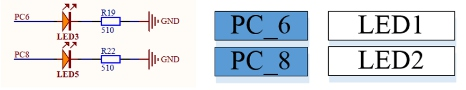

2. 按键
zhi board stm32硬件平台板载两个按键，分别连接到PC13、PB7两个引脚。

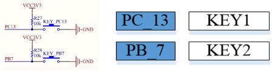
3. 蜂鸣器

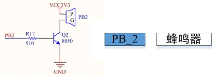

4. 电位器

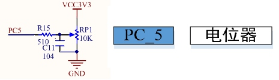
5. SD卡

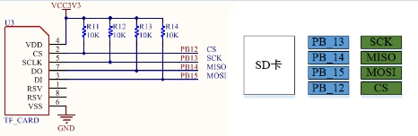
6. USB接口

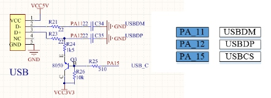
7. OLED液晶显示

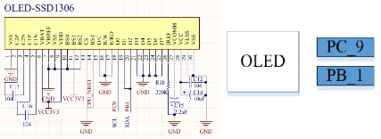

### zhi board stm32扩展资源介绍

对于硬件平台接口，您只需要知道对应的外部接口分配，即可进行编程。对应硬件平台接口图，如下图所示。用户可以根据上面定义的引脚功能分配，直接操作对应接口即可。方便简单。

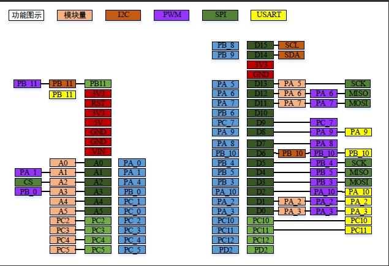

## mbed软件开发介绍
### 在线编译器
待续
### 离线编译器
待续
### 调试工具
mbed开发工具提供两种设计方法，第一种是JTAG仿真功能；第二种是串口调试功能，在mbed中下载与串口集于同一芯片中，简化了调试的复杂度。
